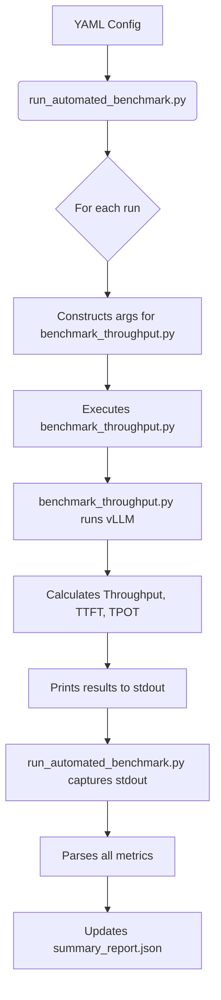

# Design Doc: Benchmark Metrics Expansion and New Workloads

**Status:** Draft
**Author:** Gemini
**Date:** 2025-06-25

## 1. Summary

This design document outlines the plan to enhance the vLLM benchmark suite. The core of the proposal is to capture additional key performance metrics (TTFT, TPOT), introduce new quantization levels (FP8, FP4) for comparison, and define a set of specific, high-priority workloads for the Ironwood hardware platform. This will provide a more comprehensive and actionable performance analysis for critical use cases like reasoning, text generation, and code generation.

## 2. Problem / Motivation

The current benchmark results for Llama 70B are promising, but they lack the granularity needed for a complete performance evaluation. The UTL has requested specific enhancements to provide deeper insights and to test hardware (A4*, Ironwood) with configurations that mirror production scenarios.

The current `summary_output.json` provides a good baseline, but to make informed decisions about hardware selection and optimization, we need to answer the following questions:
- What is the user-perceived latency (Time to First Token)?
- What is the overall generation throughput (Tokens Per Output Token)?
- How do different quantization levels (FP8, FP4) affect performance on A4* GPUs?
- How does the system perform on key workloads for Ironwood, such as reasoning, text creation, code generation, and summarization, especially under conditions with high prefix cache hit rates?

This effort is necessary now to validate the performance of new hardware and to ensure our models are optimized for the most critical, real-world applications.

## 3. Goals

The primary goals of this project are:

*   **Metric Expansion:**
    *   Capture and report average and P99 values for Time to First Token (TTFT).
    *   Capture and report average and P99 values for Throughput of Output Tokens (TPOT).
*   **New Benchmark Configurations:**
    *   Run and collect metrics for both FP8 and FP4 quantization on A4* hardware.
*   **Ironwood Workload Definition:**
    *   Implement and run benchmarks for the following key workloads on the Ironwood platform. Each workload will be defined by a specific configuration in the benchmark YAML file.
        *   **Reasoning:** Achieved by setting `--input-len 2048 --output-len 8192`.
        *   **Text Generation:** Achieved by setting `--input-len 1024 --output-len 4096`.
        *   **Chatbot:** Achieved by setting `--input-len 1024 --output-len 1024`.
        *   **Code Generation (High Cache):** Achieved by setting `--input-len 8192 --output-len 2048` and using the `--prefix-len` argument (e.g., `--prefix-len 7900`) to ensure a high prefix cache hit rate.
        *   **Summarization (High Cache):** Achieved by setting `--input-len 2048 --output-len 256` (and a 4k variant) and using the `--prefix-len` argument (e.g., `--prefix-len 1800`) for a high cache hit rate.
*   **Reporting:** All new metrics and workload results should be clearly integrated into the final `summary_report.json` and visualization outputs.

## 5. Proposed Design

The proposed solution involves a two-pronged approach:
1.  **Enhance the Benchmark Script:** Modify the underlying `vllm-repo-benchmark/benchmarks/benchmark_throughput.py` script to calculate and report the new metrics (TTFT, TPOT).
2.  **Update the Orchestrator:** Modify the `run_automated_benchmark.py` script to parse these new metrics and integrate them into the final JSON report.

### 5.1. High-Level Architecture

The overall workflow will remain the same. The `run_automated_benchmark.py` orchestrator will continue to invoke the `benchmark_throughput.py` script for each benchmark configuration specified in the YAML file. The key change is the addition of new metric calculation and reporting capabilities.



### 5.2. Detailed Design

The core of the implementation lies in how the benchmark configurations are defined in the YAML file. The existing `run_automated_benchmark.py` script is already designed to parse these configurations and generate the necessary command-line arguments for the underlying `benchmark_throughput.py` script.

*   **Quantization (FP8/FP4):** We will add the `--quantization` argument to the `args` string for a given benchmark run.
*   **Ironwood Workloads:** These will be defined by creating new run configurations with the specified `--input-len` and `--output-len` values.
*   **Prefix Caching:** To simulate a high cache hit rate for the code generation and summarization workloads, we will leverage the `--prefix-len` argument.

Below is an example of a single entry in the YAML file for the "Code Generation (High Cache)" workload, demonstrating how these parameters are combined:

```yaml
standalone_runs:
  - name: "Ironwood-CodeGen-HighCache"
    mode: vllm_throughput
    args: >-
      --model meta-llama/Llama-3.1-70B-Instruct
      --prefix-len 7900
    tensor_parallel_sizes:
      - 8
    length_configs:
      - input_len: 8192
        output_len: 2048
```


## 8. Testing Plan

1.  **Unit Test for Metric Calculation:** A small, standalone Python script will be created to test the TTFT and TPOT calculation logic using mock `RequestOutput` objects with predefined timing and token data. This will ensure the formulas are correct.
2.  **Component Test:** The modified `benchmark_throughput.py` will be run directly with a small, fast model (e.g., TinyLlama) to verify that it runs to completion and outputs the new metric lines to stdout correctly.
3.  **Integration Test:** The `run_automated_benchmark.py` orchestrator will be run with a new test YAML file that defines a single run with the new metrics enabled. We will verify that:
    *   The orchestrator correctly parses the new metrics.
    *   The final `summary_report.json` contains the new fields (`avg_ttft_s`, `p99_tpot_tokens_per_s`, etc.) with the expected numeric values.
4.  **Manual Validation:** The first full run on A4* or Ironwood will be manually inspected to ensure the results are reasonable and align with expectations.

## 9. Open Questions

1.  **Quantization Method:** What is the exact `--quantization` parameter value to use for FP8 and FP4 in vLLM? Is it `'fp8'`, `'awq'`, `'gptq'`, or something else? This needs to be confirmed from the vLLM documentation.
2.  **Prefix Caching Simulation:** Is using `--prefix-len` the most accurate way to simulate a high prefix cache hit rate? Are there other vLLM features or benchmark parameters that would provide a more realistic simulation?
3.  **Metric Availability:** We are assuming the `RequestOutput.metrics` field will be populated with accurate `first_token_time`, `last_token_time`, and `arrival_time`. We need to verify this is the case. If not, we may need to add manual `time.perf_counter()` calls within the benchmark script, which is less ideal.
